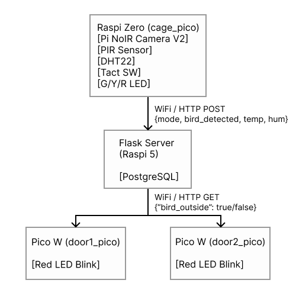
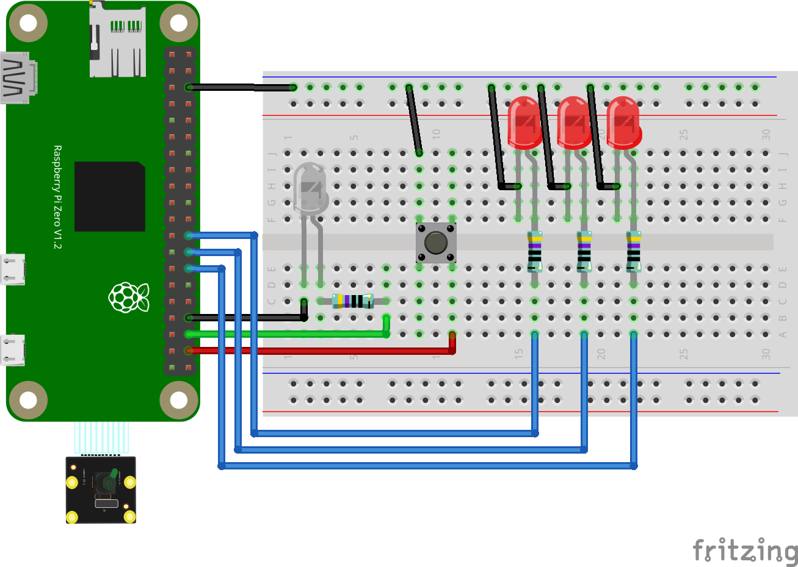
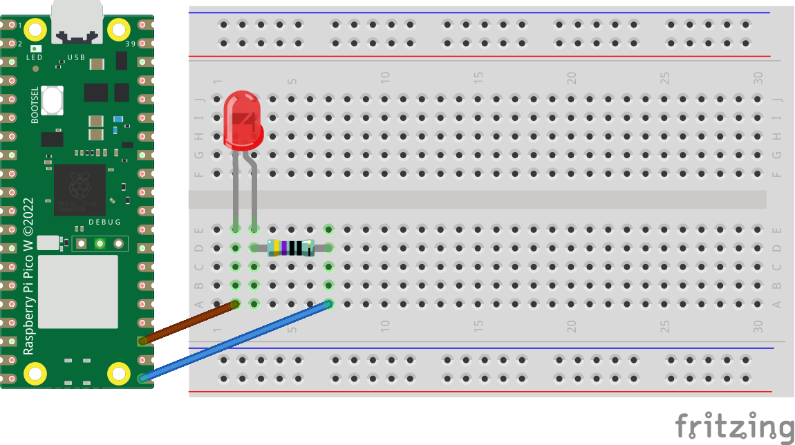

# BirdMonitoring

セキセイインコなどの小鳥の放鳥中に、他の家族が部屋にやってきて、その足で…
といった事故を防ぐシステム。
カゴ内カメラ映像を YOLOv8n で解析し、鳥がカゴの外にいるときはドア2か所の LED を点灯させて警告する。

---

## システム構成



---

## 動作モード

| モード | 説明 | ドア LED |
|--------|------|----------|
| INSIDE | YOLO が鳥をカゴ内で検知 | 消灯 |
| OUTSIDE | YOLO が鳥を検知できず（外にいる可能性） | 点灯 |

### モード遷移

- **YOLO 自動判定**（10秒ごと）：bird 検知 → INSIDE、未検知 → OUTSIDE

---

## フォルダ構成

```
BirdMonitoring/
├── docker-compose.yml       # サーバー側全体（YOLO API・Flask・PostgreSQL）
├── cage_pico/
│   └── main.py              # カゴ用 Raspi Zero（Python）
├── door_pico/
│   └── main.py              # ドア用 Pico W（MicroPython、2台共通）
├── BirdYolo/
│   ├── app.py               # YOLO 推論 API（FastAPI）
│   ├── Dockerfile
│   └── requirements.txt
└── server/
    ├── app.py               # Flask サーバー・API
    ├── Dockerfile
    ├── requirements.txt
    └── templates/
        └── index.html       # ダッシュボード（温湿度グラフ・状態表示）
```

---

## ハードウェア

### cage（カゴ用 Raspi Zero）

| コンポーネント | ピン / インタフェース | 接続 |
|--------------|-------------------|------|
| Pi NoIR Camera V2 | CSI リボンケーブル | カメラポート直結 |
| PIR センサー | GPIO（任意） | デジタル入力 |
| DHT22 データ | GPIO2（物理ピン3） | デジタル入出力 |
| 緑 LED | GPIO18 | 470Ω 直列 |
| 黄 LED | GPIO19 | 470Ω 直列 |
| 赤 LED | GPIO20 | 470Ω 直列 |



温度 LED の判定基準（セキセイインコ向け）：

| 温度範囲 | LED |
|---------|-----|
| 20〜28℃ | 緑（適切） |
| 15〜34℃（上記除く） | 黄（注意） |
| 15℃未満 / 34℃超 | 赤（危険） |

### door_pico（ドア用 Pico W、2台共通）

| コンポーネント | GPIO |
|--------------|------|
| 赤 LED（警告） | GP15 |



---

## セットアップ

### 1. サーバー（Raspi 5）の起動

YOLO 推論 API・Flask ダッシュボード・PostgreSQL をまとめて起動します。

```bash
docker compose up -d
```

起動確認：

```bash
curl http://localhost:8080/health   # YOLO API
curl http://localhost:5000/         # ダッシュボード
```

### 2. cage_pico の設定

`cage_pico/main.py` の先頭にある設定値を環境に合わせて変更

```python
SSID               = "your-ssid"
PASSWORD           = "your-password"
YOLO_URL           = "http://<RaspberryPi5-IP>:8080/detect"
FLASK_URL          = "http://<RaspberryPi5-IP>:5000"
```

カメラは `picamera2` ライブラリを使用します（Raspberry Pi OS 上では標準搭載）。

```bash
sudo apt install -y python3-picamera2
```

### 3. door_pico の設定

`door_pico/main.py` の先頭を変更

```python
SSID     = "your-ssid"
PASSWORD = "your-password"
```

2台とも同じファイルを使用できる。


---

## API エンドポイント

### YOLO 推論 API（BirdYolo、ポート 8080）

| エンドポイント | メソッド | 説明 |
|--------------|---------|------|
| `/health` | GET | 動作確認 |
| `/detect` | POST | JPEG 画像を受け取り鳥を判定 |

`/detect` レスポンス例：

```json
{"bird_detected": true, "confidence": 0.823}
```

### Flask サーバー API（ポート 5000）

| エンドポイント | メソッド | 説明 |
|--------------|---------|------|
| `/` | GET | ダッシュボード HTML |
| `/api/health` | POST | モード・在籍推定・温湿度を受信し DB に保存 |
| `/api/status` | GET | `{"bird_outside": bool}` を返す（door_pico ポーリング用） |
| `/api/sensor_data_list` | GET | 温湿度ログを JSON 配列で返す（Chart.js 用） |

---

## 動作確認

| # | 確認項目 | 期待される動作 |
|---|---------|--------------|
| 1 | 鳥がカゴ内にいる | YOLO が bird 検知 → INSIDE、ドア LED 消灯 |
| 2 | 鳥が外にいる | YOLO が未検知 → OUTSIDE、ドア LED 2台点灯 |
| 3 | 静止・睡眠中の鳥 | YOLO が検知 → INSIDE を維持 |
| 4 | サーバー切断時 | door_pico がポーリング失敗、LED 消灯（安全側） |
| 5 | 温度 25℃ 環境 | 緑 LED 点灯 |
| 6 | 温度 15℃ 以下 | 赤 LED 点灯 |

---

## フェイルセーフ

- door_pico が Flask サーバーとの通信に失敗した場合、`bird_outside = False`（消灯）として安全側に倒します。
- YOLO API との通信失敗時は `bird_detected = False`（安全側）として扱います。

---

## 使用技術

| 区分 | 技術 |
|------|------|
| カゴ用デバイス | Raspberry Pi Zero（Python） |
| ドア用デバイス | Raspberry Pi Pico W × 2（MicroPython） |
| カメラ | Raspberry Pi Pi NoIR Camera V2（CSI） |
| センサー | PIR センサー（動体検知）、DHT22（温湿度） |
| 画像判定 | YOLOv8n（COCO、bird クラス ID: 14、信頼度閾値 40%） |
| 推論サーバー | FastAPI + Uvicorn、Docker（Raspi 5） |
| ダッシュボード | Flask、PostgreSQL、Chart.js（Raspi 5） |
| 通信 | WiFi / HTTP（multipart、JSON） |
